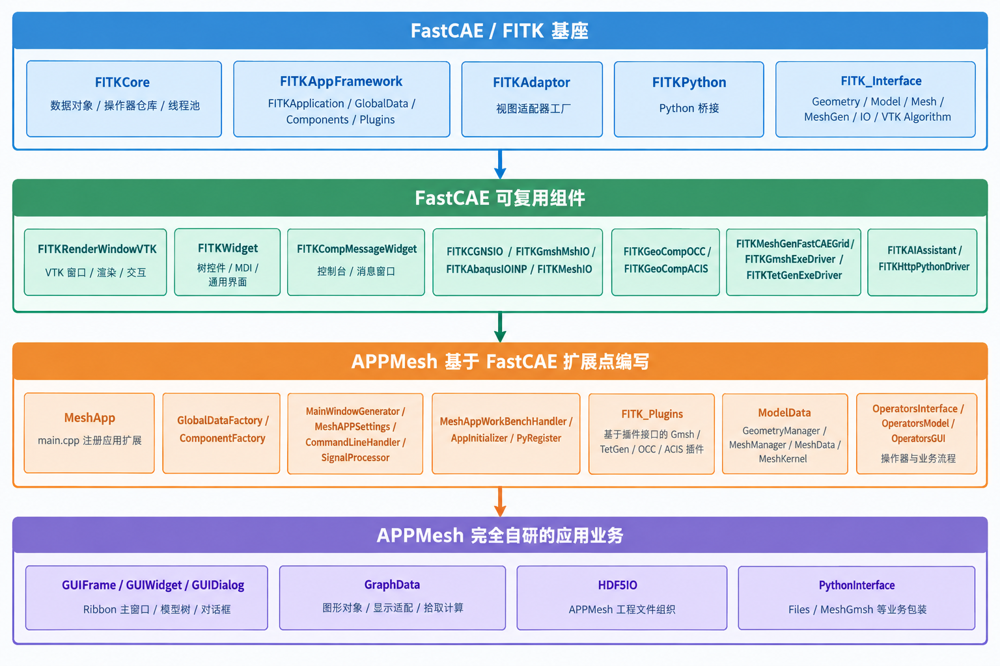

# APPMesh 开发过程与总体架构

## 1. 项目定位

APPMesh 是建立在 FastCAE/FITK 框架上的几何与网格应用软件。FastCAE 提供应用运行框架、抽象接口和可复用组件；APPMesh 通过注册器、工厂、操作器和插件机制接入这些能力，并实现面向用户的具体业务。

阅读源码时区分四类代码：

| 标记 | 含义 | 典型目录 |
| --- | --- | --- |
| **F：FastCAE 基座** | 运行框架、抽象接口和管理机制 | `FITK_Kernel`、`FITK_Interface` |
| **C：FastCAE 组件** | 已实现的可复用功能 | `FITK_Component` |
| **E：APPMesh 扩展** | 继承 FastCAE 接口，或通过 `regXXX()`、工厂、插件接入框架 | `MeshApp`、`FITK_Plugins`、部分 `ModelData`/`Operators*` |
| **A：APPMesh 自研业务** | APPMesh 的界面、业务流程、显示规则和工程组织 | `GUIFrame`、`GraphData`、`HDF5IO`、`PythonInterface` |

## 2. 总体架构图



依赖方向为：

```text
FastCAE 基座（F） → FastCAE 组件（C） → APPMesh 扩展（E） → APPMesh 业务（A）
```

> F 层定义规则，C 层提供能力，E 层把 APPMesh 接入 FastCAE，A 层实现用户功能。

## 3. F 层：FastCAE 基座

### 3.1 `FITKCore`

提供 `FITKAbstractDataObject`、`FITKAbstractDataManager<T>`、`FITKActionOperator`、`FITKOperatorRepo`、`FITKThreadPool`、数据仓库和文件工具。APPMesh 的数据对象、操作器、异步导入导出和图形对象管理都直接使用这些类型。

### 3.2 `FITKAppFramework`

提供 `FITKApplication`、`FITKGlobalData`、组件管理器、插件管理器、全局信号、应用设置、WorkBench，以及主窗口、全局数据和组件工厂等抽象接口。APPMesh 不重写这套生命周期，而是在 `main.cpp` 注册自己的实现。

### 3.3 `FITKAdaptor` 与 `FITKPython`

`FITKAdaptor` 提供数据到视图的适配器工厂；`FITKPython` 提供 C++ 类型注册和 Python 桥接。APPMesh 的 `GraphData`、`PyRegister` 和 `PythonInterface` 建立在这些机制上。

### 3.4 `FITK_Interface`

定义跨组件使用的抽象协议：

| 接口 | 主要内容 |
| --- | --- |
| `FITKInterfaceGeometry` | 几何命令、导入和命令列表 |
| `FITKInterfaceModel` | 模型、网格、单元、集合和组件 |
| `FITKInterfaceMesh` | 结构化/非结构化网格 |
| `FITKInterfaceMeshGen` | 网格生成器和驱动 |
| `FITKInterfaceIO` | HDF5 等 IO 接口 |
| `FITKVTKAlgorithm` | VTK Actor 和显示算法 |
| `FITKInterfaceStructural` | Abaqus/结构数据 |
| `FITKInterfacePhysics`、`StructuralPost` | 物理场和后处理抽象 |

## 4. C 层：FastCAE 可复用组件

| 组件 | 功能 |
| --- | --- |
| `FITKRenderWindowVTK` | VTK 窗口、渲染、交互和拾取 |
| `FITKWidget` | 树控件、MDI 和通用界面 |
| `FITKCompMessageWidget` | 控制台和消息窗口 |
| `FITKGeoCompOCC` / `FITKGeoCompACIS` | OCC/ACIS 几何内核 |
| `FITKMeshGenFastCAEGrid` | FastCAE 网格引擎 |
| `FITKGmshExeDriver` / `FITKTetGenExeDriver` | Gmsh/TetGen 驱动 |
| `FITKCGNSIO` / `FITKGmshMshIO` / `FITKMeshIO` | 网格文件读写 |
| `FITKAbaqusData` / `FITKAbaqusIOINP` | Abaqus 数据和 INP 读写 |
| `FITKAIAssistant` / `FITKHttpPythonDriver` | AI 和 HTTP/Python 能力 |

APPMesh 在 `ComponentFactory` 中选择并实例化这些组件，不重复实现组件内部功能。

## 5. E 层：APPMesh 对 FastCAE 的扩展

### 5.1 `regXXX()` 注册

入口为 [MeshApp/main.cpp](../MeshApp/main.cpp)：

```cpp
app.regMainWindowGenerator(new MainWindowGenerator);
app.regGlobalDataFactory(new GlobalDataFactory);
app.regComponentsFactory(new ComponentFactory);
app.regAppSettings(new MeshAPPSettings);
app.regCommandLineHandler(new CommandLineHandler);
app.addGolbalSignalProcesser(new SignalProcessor);
app.regWorkBenchHandler(new MeshAppWorkBenchHandler);
app.regAppInitalizer(new AppInitializer);
app.regPythonRegister(new PyRegister);
```

`regXXX()` 由 FastCAE 提供，传入对象由 APPMesh 编写：

| 扩展点 | APPMesh 实现 | 职责 |
| --- | --- | --- |
| 主窗口生成器 | `MainWindowGenerator` | 创建 `GUI::MainWindow` |
| 全局数据工厂 | `GlobalDataFactory` | 创建几何/网格数据 |
| 组件工厂 | `ComponentFactory` | 装配 FastCAE 组件 |
| 设置 | `MeshAPPSettings` | 读写 `MeshAPP.ini` |
| 命令行 | `CommandLineHandler` | 扩展命令行处理 |
| 信号处理 | `SignalProcessor` | 转换程序驱动消息 |
| WorkBench | `MeshAppWorkBenchHandler` | 批量输入和输出 |
| 初始化器 | `AppInitializer` | 初始化 AI 资源 |
| Python 注册 | `PyRegister` | 注册 APPMesh Python 对象 |

### 5.2 数据模型扩展

```text
FITKGlobalData → MeshManager → MeshData → MeshKernel → FITKAbstractMesh
```

`GeometryManager` 直接继承 FastCAE 的 `FITKGeoCommandList`。`MeshManager` 使用 FastCAE 数据管理器，并维护“网格类型名称 → `MeshData` 创建函数”的映射，使 TetGen、Gmsh 等插件能够注册自己的网格类型。

### 5.3 操作器扩展

```text
QAction → objectName → FITKOperatorRepo → FITKActionOperator
                                      ├─ execGUI()
                                      └─ execProfession()
```

`OperatorsModel`、`OperatorsGUI` 和 `OperatorsInterface` 继承或使用 FastCAE 操作器机制，实现导入、导出、打开、保存、拾取和图形更新。FastCAE 提供路由和执行机制，APPMesh 提供业务逻辑。

### 5.4 插件扩展

`FITK_Plugins` 使用 FastCAE 插件基类和插件管理器，但具体代码属于 APPMesh 扩展。例如 TetGen 插件安装时会创建 TetGen 驱动、注册生成操作器、添加 Ribbon 按钮，并向 `MeshManager` 注册 `MeshDataTetGenExec` 创建器。

## 6. A 层：APPMesh 自研业务

### 6.1 界面模块

`GUIFrame`、`GUIWidget`、`GUIDialog` 实现 Ribbon、主窗口、模型树、控制面板、VTK 区域、控制台、AI Dock、工作目录和几何分组对话框。底层控件来自 FastCAE/Qt，界面布局和业务交互由 APPMesh 决定。

### 6.2 图形模块

`GraphData` 实现几何/网格显示对象、数据到 VTK 的适配、点选、框选、预选高亮和图形刷新。VTK 算法和窗口来自 FastCAE，显示规则由 APPMesh 编写。

### 6.3 工程和脚本模块

`HDF5IO` 负责组织 APPMesh 工程中的几何、网格、插件数据和工程结构；`PythonInterface` 定义 `Files`、`MeshGmsh` 等 APPMesh 业务包装。FastCAE 提供基础 IO/Python 机制，APPMesh 决定保存内容和暴露的业务接口。

## 7. 启动与运行流程

```text
main.cpp 创建 FITKApplication
    ↓ 系统检查、读取配置
GlobalDataFactory 创建全局数据
    ↓
ComponentFactory 创建组件
    ↓
PyRegister 注册 Python
    ↓
MainWindowGenerator 创建主窗口
    ↓
FITKPluginsManager 加载插件
    ↓
WorkBench/命令行处理
    ↓
AppInitializer 执行应用初始化
    ↓
进入 Qt 事件循环
```

## 8. 判断源码归属的方法

| 源码特征 | 归属 |
| --- | --- |
| `.gitmodules` 指向的子模块 | FastCAE 基座或组件 |
| `FITK...` 类型的通用实现 | FastCAE 基座/组件 |
| 继承 `FITK...` 抽象类或出现 `regXXX()` | APPMesh 的 FastCAE 扩展 |
| 插件安装、操作器注册、网格创建器注册 | APPMesh 插件扩展 |
| 窗口布局、业务流程、显示规则 | APPMesh 自研业务 |

## 9. 建议阅读顺序

1. `MeshApp/main.cpp`：启动和注册。
2. `FITKAppFramework.cpp`：FastCAE 初始化生命周期。
3. `GlobalDataFactory`、`MeshManager`、`GeometryManager`：数据模型。
4. `ComponentFactory`：组件装配。
5. `GUIFrame/MainWindow.cpp`：界面组织。
6. `OperatorsModel`、`OperatorsGUI`：业务操作器。
7. `GraphData`、`PreWindowInitializer`：显示和拾取。
8. `FITK_Plugins`：网格插件接入。
9. `HDF5IO`、`PythonInterface`：持久化和脚本扩展。
