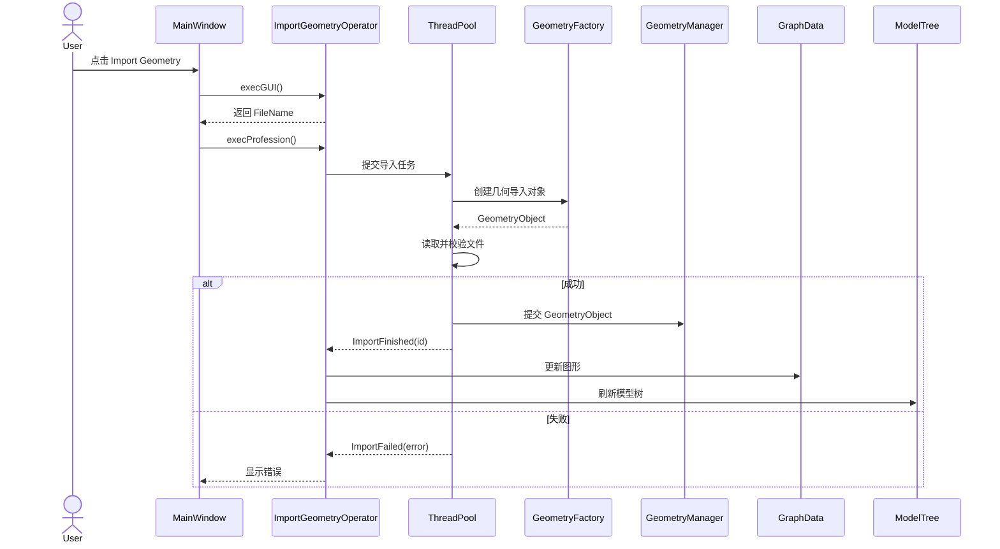
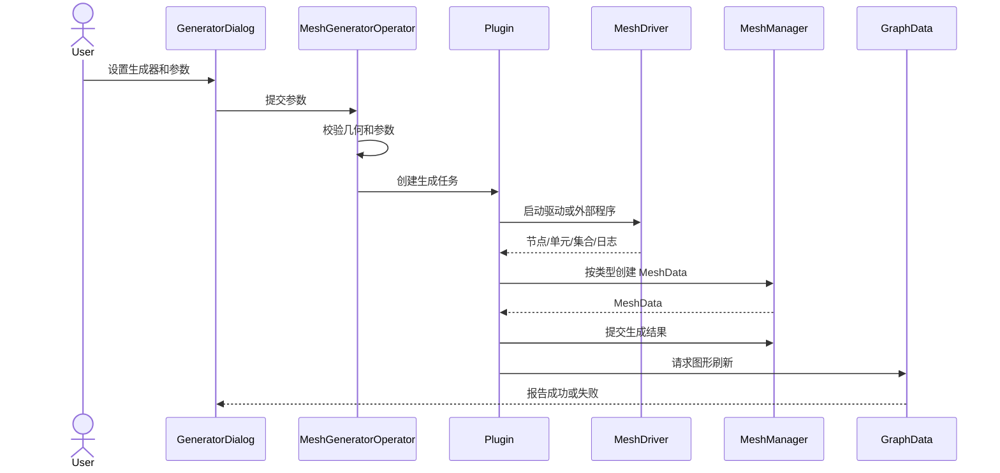
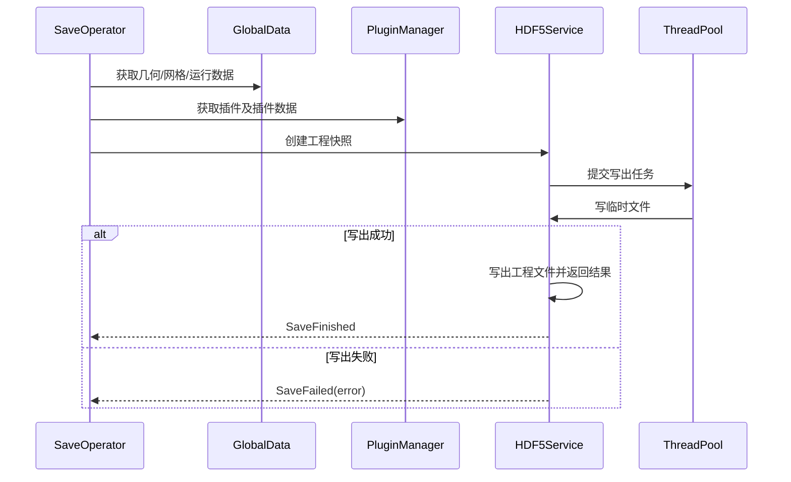

# APPMesh 系统设计报告

**文档版本：** V1.0  
**文档定位：** 按 APPMesh 既有源码架构抽象整理，用于在无现有源码条件下重新实现 APPMesh  
**适用对象：** 系统架构师、开发人员、测试人员、部署人员

> 本报告描述“系统如何实现”。模块名称、层次关系和关键职责与 APPMesh 既有架构保持一致；重新开发时应保持外部行为和模块协作关系，内部代码可以自行组织。

## 1. 设计目标与原则

### 1.1 设计目标

系统应实现几何导入、网格数据管理、网格生成、三维显示、文件交换、工程保存、插件扩展和 Python/HTTP/AI 接入，并保持与 FastCAE/FITK 框架的统一集成方式。

### 1.2 设计原则

1. **复用优先**：应用生命周期、数据接口、渲染、IO、线程和插件管理优先使用 FastCAE 能力。
2. **分层解耦**：基座、组件、应用扩展和业务界面分层组织。
3. **接口隔离**：业务层依赖几何、网格、IO 和显示抽象，不直接依赖具体外部程序。
4. **异步执行**：几何导入、网格生成和大型文件 IO 不得阻塞界面。
5. **插件扩展**：新增网格引擎或几何能力不应修改主程序核心流程。
6. **数据一致性**：失败和退出时不得产生残缺对象或悬空引用；首版不定义统一取消流程。

## 2. 总体架构

```text
┌─────────────────────────────────────────────────────────────┐
│                    APPMesh 应用业务层                       │
│ GUIFrame / GUIWidget / GUIDialog / GraphData / HDF5IO       │
│ PythonInterface / OperatorsModel / OperatorsGUI             │
└──────────────────────────────┬──────────────────────────────┘
                               │ 使用 FastCAE 扩展点和组件
┌──────────────────────────────▼──────────────────────────────┐
│                 APPMesh 框架扩展与插件层                    │
│ MeshApp / GlobalDataFactory / ComponentFactory               │
│ MainWindowGenerator / WorkBench / AppInitializer / PyRegister│
│ FITK_Plugins / ModelData / OperatorsInterface                │
└──────────────────────────────┬──────────────────────────────┘
                               │
┌──────────────────────────────▼──────────────────────────────┐
│                    FastCAE 可复用组件层                     │
│ VTK 渲染 / Widget / 消息窗口 / 几何内核 / 网格驱动 / IO      │
│ AI 助手 / HTTP-Python 驱动                                  │
└──────────────────────────────┬──────────────────────────────┘
                               │
┌──────────────────────────────▼──────────────────────────────┐
│                     FastCAE/FITK 基座                       │
│ FITKApplication / GlobalData / Components / Plugins         │
│ FITKCore / FITK_Interface / FITKAdaptor / FITKPython         │
└─────────────────────────────────────────────────────────────┘
```

## 3. FastCAE 复用与接入设计

### 3.1 基座能力映射

| FastCAE 能力 | APPMesh 使用方式 |
| --- | --- |
| `FITKApplication` | 作为应用对象，负责初始化、事件循环和退出 |
| `FITKGlobalData` | 保存全局几何、网格、设置、历史文件和主窗口 |
| `FITKCmponents` | 统一持有和查询组件 |
| `FITKPluginsManager` | 发现、加载、卸载插件 |
| `FITKOperatorRepo` | 按动作名称查找和执行操作器 |
| `FITKThreadPool` | 执行导入、生成和 IO 后台任务 |
| `FITKAbstractDataObject` | 统一数据对象生命周期 |
| `FITKInterface*` | 几何、网格、IO、模型和 VTK 抽象接口 |
| `FITKAdaptor` | 模型数据到显示对象的适配 |
| `FITKPython` | C++ 业务对象的 Python 暴露 |

### 3.2 组件选型

| 组件 | 设计职责 |
| --- | --- |
| `FITKRenderWindowVTK` | 三维窗口、渲染器、交互样式和拾取 |
| `FITKWidget` | 树控件、MDI 和通用界面 |
| `FITKCompMessageWidget` | 控制台、日志和消息显示 |
| `FITKGeoCompOCC` / `FITKGeoCompACIS` | 几何内核实现 |
| `FITKCGNSIO` / `FITKGmshMshIO` / `FITKMeshIO` | 网格文件读写 |
| `FITKAbaqusData` / `FITKAbaqusIOINP` | Abaqus 数据和 INP 文件 |
| `FITKMeshGenFastCAEGrid` | FastCAE 网格引擎 |
| `FITKGmshExeDriver` / `FITKTetGenExeDriver` | 外部网格程序驱动 |
| `FITKAIAssistant` / `FITKHttpPythonDriver` | AI 和 HTTP/Python 扩展 |

### 3.3 应用扩展点

应用必须提供以下扩展对象，并在启动阶段注册到 FastCAE：

| 扩展对象 | 设计职责 |
| --- | --- |
| `MainWindowGenerator` | 创建 `GUI::MainWindow` |
| `GlobalDataFactory` | 创建 `GeometryManager` 和 `MeshManager` |
| `ComponentFactory` | 创建、配置和装配组件 |
| `MeshAPPSettings` | 管理应用配置 |
| `CommandLineHandler` | 处理命令行和无界面模式 |
| `SignalProcessor` | 将程序驱动消息转换为应用消息 |
| `MeshAppWorkBenchHandler` | 处理批量输入和输出 |
| `AppInitializer` | 初始化运行资源 |
| `PyRegister` | 注册 APPMesh Python 业务对象 |

## 4. 应用生命周期设计

启动顺序必须保持如下关系：

```text
创建 FITKApplication
    ↓
系统检查
    ↓
读取应用配置
    ↓
创建全局数据
    ↓
创建并初始化组件
    ↓
注册 Python 接口
    ↓
创建主窗口
    ↓
加载插件
    ↓
执行命令行/WorkBench 输入
    ↓
执行应用初始化器
    ↓
进入 Qt 事件循环
```

退出顺序：

```text
停止自动保存
    ↓
等待后台任务
    ↓
写出插件配置和历史文件
    ↓
保存应用配置
    ↓
执行 WorkBench 输出
    ↓
释放窗口、插件、组件和全局数据
```

## 5. 模块设计

### 5.1 `MeshApp` 应用装配模块

**职责：** 创建应用对象，注册所有 APPMesh 扩展点，设置应用名称和插件关键字，并启动框架。

**主要子模块：**

- `main.cpp`：入口和注册；
- `MainWindowGenerator`：主窗口生成；
- `GlobalDataFactory`：全局数据生成；
- `ComponentFactory`：组件装配；
- `MeshAPPSettings`：配置；
- `CommandLineHandler`：命令行；
- `MeshAppWorkBenchHandler`：工作流；
- `AppInitializer`：初始化；
- `SystemChecker`：运行环境检查；
- `SignalProcessor`：消息处理；
- `PyRegister`：Python 注册。

### 5.2 `ModelData` 数据模块

数据层级设计如下：

```text
FITKGlobalData
    ├── GeometryManager
    │     └── FITKGeoCommandList
    └── MeshManager
          └── MeshData
                └── MeshKernel
                      └── FITKAbstractMesh
```

#### `GeometryManager`

继承或组合 FastCAE 几何命令列表，负责几何对象的统一保存、查询、命名和生命周期管理。

#### `MeshManager`

负责管理多个 `MeshData`，并维护：

```text
网格类型名称 → MeshData 创建器
```

提供按名称查询、创建、加入、删除和清理能力。

#### `MeshData`

表示某一类网格数据集合，可包含多个 `MeshKernel`，并保存网格生成器类型、参数和工程关联信息。

#### `MeshKernel`

包装一个具体 `FITKAbstractMesh`，保存二维/三维/混合维度、关联几何 ID 和网格组件集合，并负责具体网格对象的生命周期。

### 5.3 `GUIFrame` 界面模块

`GUI::MainWindow` 继承 FastCAE/Qt 主窗口能力，负责：

- Ribbon 文件、主页和帮助页面；
- 左侧 `ControlPanel` 和模型树；
- 中央 `RenderWidget` 三维区域；
- 下方 `ConsoleWidget`；
- 右侧 AI 助手 Dock；
- QAction 创建和动作事件连接。

界面动作使用稳定的动作名称，例如 `actionOpen`、`actionSave`、`actionImportGeometry`。动作名称是操作器路由的协议，不应随意改变。

### 5.4 `GUIWidget` 与 `GUIDialog`

`GUIWidget` 提供模型树节点、树模型和业务控件；`GUIDialog` 提供几何分组、工作目录等业务对话框。通用树和窗口控件优先复用 FastCAE 组件，节点内容和业务校验由 APPMesh 定义。

### 5.5 操作器模块

操作器采用统一的两阶段执行模型：

```text
用户动作
  ↓
操作器 execGUI()
  ↓ 收集和校验参数
操作器 execProfession()
  ↓ 执行实际业务
后台任务/组件/全局数据
  ↓
结果通知和界面刷新
```

主要操作器包括：

- 几何导入；
- 工程新建、打开、保存；
- FITKMesh、CGNS、Abaqus 等导入导出；
- 工作目录设置；
- 插件窗口；
- 图形拾取、预览和图形更新。

操作器必须通过操作器仓库访问，不允许界面直接调用外部程序或修改底层数据。

### 5.6 `GraphData` 图形模块

图形模块采用“数据—适配器—图形对象—渲染窗口”结构：

```text
GeometryManager / MeshManager
          ↓
GraphDataProvider
          ↓
ViewAdaptor
          ↓
GraphObject
          ↓
FITKRenderWindowVTK
```

负责：

- 几何和网格图形对象创建；
- 数据变化后的图形更新；
- 显示/隐藏和高亮；
- 点选、框选、预选；
- 将拾取结果传递给操作器。

### 5.7 `PreWindowInitializer` 交互初始化

三维窗口初始化器负责设置：

- 图形显示层数；
- APPMesh 自定义交互样式；
- 点选、框选和橡皮筋区域选择；
- 鼠标移动预选高亮；
- 与 `GraphPick`、`GraphPickPreview`、`GraphPreprocess` 操作器的连接。

### 5.8 `FITK_Plugins` 插件模块

每个插件应遵循统一生命周期：

```text
插件发现
  ↓
动态加载
  ↓
install()
  ├─ 注册 Ribbon 页面和 QAction
  ├─ 注册操作器
  ├─ 创建 FastCAE 驱动组件
  └─ 注册网格数据创建器
  ↓
插件运行
  ↓
unInstall()
  ├─ 注销操作器和网格创建器
  ├─ 移除组件
  └─ 清理界面资源
```

插件不得直接依赖其他插件的内部实现，应通过公共接口、全局数据和组件管理器协作。

### 5.9 `HDF5IO` 工程模块

工程保存流程：

```text
收集全局几何和网格数据
    ↓
收集已加载插件及插件数据
    ↓
组织工程元数据和版本信息
    ↓
调用 HDF5 写出组件
    ↓
异步完成通知
    ↓
更新当前工程路径和历史文件
```

工程打开流程与之相反，先校验项目类型和文件版本，再恢复基础数据及当前已加载插件数据。未知或未加载插件数据不保证恢复，必须记录兼容性诊断；不得因单个插件数据不可用而清空当前有效工程。

### 5.10 `PythonInterface` 和 HTTP 模块

Python 设计分两层：

1. FastCAE 提供解释器、类型注册和调用桥接；
2. APPMesh 提供 `Files`、`MeshGmsh` 等业务包装。

HTTP 模式复用相同的业务服务层，不应为 HTTP 重新实现一套几何、网格和工程逻辑。

### 5.11 AI 助手模块

AI 助手作为可选组件加载。启动时初始化技能资源；资源失败只影响 AI 功能，不得阻止几何、网格和文件核心功能启动。

## 6. 核心业务流程

### 6.1 几何导入

```text
用户点击 Import Geometry
    ↓
操作器收集文件路径
    ↓
后台任务创建几何导入对象
    ↓
调用 FastCAE 几何接口读取文件
    ↓
加入 GeometryManager
    ↓
发布导入完成事件
    ↓
GraphData 更新显示，模型树刷新
```

### 6.2 网格生成

```text
用户选择网格插件
    ↓
输入并校验生成参数
    ↓
创建网格生成任务
    ↓
调用驱动组件或外部程序
    ↓
解析节点、单元和边界集合
    ↓
通过 MeshManager 创建对应 MeshData
    ↓
关联几何并更新显示
```

### 6.3 文件导出

```text
用户选择导出格式
    ↓
选择网格对象和输出路径
    ↓
校验数据完整性
    ↓
调用对应 FastCAE IO 组件
    ↓
后台写出文件
    ↓
报告成功或错误信息
```

## 7. 线程与任务设计

### 7.1 必须异步的任务

- 几何文件导入；
- 大型网格文件读写；
- 网格生成器执行；
- 工程 HDF5 保存和打开；
- 外部程序启动和输出解析。

### 7.2 任务状态

后台任务统一报告以下状态；首版不提供跨任务的取消接口：

```text
未开始 → 准备中 → 运行中 → 成功
                         └→ 失败
```

任务完成后只能在主线程更新 Qt 界面；后台线程不得直接操作窗口控件。

## 8. 错误处理和一致性设计

错误分为配置错误、输入文件错误、组件错误、插件错误、外部程序错误、IO 错误和资源不足错误。每种错误必须：

1. 保留可诊断日志；
2. 显示用户可理解的提示；
3. 不破坏已有有效数据；
4. 正确结束后台任务并释放临时资源。

对象创建应采用“创建—校验—提交”模式：只有读取或生成成功后，才将对象加入全局管理器。

## 9. 配置、工程与部署设计

### 9.1 配置内容

- 工作目录；
- 最近打开文件；
- 插件启用状态和路径；
- 界面设置；
- 外部程序路径；
- AI/HTTP 模式配置。

### 9.2 运行目录

```text
output/
├── bin/                 Release 主程序和组件
│   ├── Plugins/         Release 插件
│   ├── platforms/       Qt 平台插件
│   └── 资源和外部程序
└── bin_d/               Debug 主程序和组件
    ├── Plugins/         Debug 插件
    └── platforms/
```

部署必须保证 Qt、VTK、SARibbon、FastCAE 库、插件 DLL、外部网格程序和 AI 资源可以被发现。

## 10. 安全、性能和可维护性设计

### 10.1 性能

- 耗时任务全部异步；
- 避免重复创建图形对象；
- 大型工程采用增量或分阶段恢复；
- 外部程序输出采用流式读取，避免无限制缓存。

### 10.2 稳定性

- 插件异常不得拖垮主程序；
- 任务退出时禁止创建新任务并等待已有任务结束；
- 工程写出使用临时文件和成功后替换策略；
- 数据对象由唯一管理器负责生命周期。

### 10.3 可维护性

- 界面不直接操作底层数据；
- 操作器不直接承担图形绘制；
- 网格引擎通过统一接口接入；
- 文件格式通过 IO 组件隔离；
- 组件和插件通过名称和接口查询，不依赖具体实现细节。

## 11. 设计到需求的对应关系

| 需求域 | 主要设计模块 |
| --- | --- |
| 应用启动和配置 | `MeshApp`、FastCAE 应用框架 |
| 几何管理 | `GeometryManager`、几何接口、几何组件 |
| 网格管理 | `MeshManager`、`MeshData`、`MeshKernel` |
| 网格生成 | `FITK_Plugins`、网格驱动组件、任务服务 |
| 三维显示 | `GraphData`、`PreWindowInitializer`、VTK 组件 |
| 文件 IO | `HDF5IO`、FastCAE IO 组件 |
| 工程管理 | 工程服务、HDF5 读写、插件数据接口 |
| 插件扩展 | 插件管理器、插件安装/卸载协议 |
| Python/HTTP/AI | `PythonInterface`、扩展组件 |

## 12. 重新开发实施顺序

1. 准备 Qt、VTK、SARibbon、FastCAE/FITK 和外部程序依赖。
2. 建立与架构一致的 CMake 工程和运行目录。
3. 创建 `FITKApplication` 并完成应用扩展点注册。
4. 实现 `GlobalDataFactory`、`GeometryManager` 和网格数据层。
5. 装配 VTK、消息、Widget、几何和 IO 组件。
6. 实现主窗口、模型树、控制台和三维窗口。
7. 实现操作器仓库中的导入、导出、打开和保存业务。
8. 实现 `GraphData`、拾取和显示刷新。
9. 接入 Gmsh、TetGen、FastCAE Grid 等插件。
10. 实现 HDF5 工程恢复、Python/HTTP 和 AI 扩展。
11. 按验收场景进行集成测试、部署测试和异常测试。

## 13. 设计约束总结

重新开发后的 APPMesh 必须保持以下架构事实：

```text
FastCAE 负责通用运行机制和专业组件
APPMesh MeshApp 负责应用装配
APPMesh ModelData 负责几何/网格业务数据组织
APPMesh Operators 负责用户动作到业务执行
APPMesh GraphData 负责业务数据到图形显示
APPMesh FITK_Plugins 负责网格引擎扩展
APPMesh HDF5IO 负责工程数据组织
```

只要上述职责边界、调用顺序、数据流和外部行为保持一致，重新开发可以使用不同的内部代码实现。

## 14. 详细模块接口设计

本章给出重新开发时必须具备的逻辑接口。接口名称可按语言规范调整，但参数语义、返回结果、生命周期和线程约束必须保持一致。

### 14.1 应用框架接口

应用启动器必须提供以下能力：

```cpp
class Application
{
public:
    void registerMainWindowGenerator(MainWindowGenerator* generator);
    void registerGlobalDataFactory(GlobalDataFactory* factory);
    void registerComponentFactory(ComponentFactory* factory);
    void registerSettings(AppSettings* settings);
    void registerCommandLineHandler(CommandLineHandler* handler);
    void registerWorkbenchHandler(WorkbenchHandler* handler);
    void registerInitializer(AppInitializer* initializer);
    void registerPython(PythonRegister* registrar);
    int run(int argc, char** argv);
};
```

启动器必须保证：

1. 所有注册对象在应用退出前有效；
2. 全局数据先于组件创建；
3. 组件先于插件使用；
4. 主窗口创建后才允许更新界面；
5. 退出前等待所有后台任务；
6. 初始化失败时不进入事件循环。

### 14.2 全局数据接口

全局数据管理器提供以下逻辑接口：

```cpp
enum GlobalDataType { Mesh, Geometry, Physics, Post, Other };

class GlobalData
{
public:
    void setMainWindow(MainWindow* window);
    MainWindow* mainWindow() const;
    void insert(GlobalDataType type, DataObject* object);
    DataObject* get(GlobalDataType type) const;
    RuntimeSettings* runtimeSettings() const;
    HistoryFiles* historyFiles() const;
};
```

`GlobalData` 拥有插入对象的生命周期。业务模块只能通过接口查询和修改允许修改的数据，不得自行删除全局对象。

### 14.3 组件接口

所有组件必须提供唯一名称、初始化、执行和可选界面端口：

```cpp
class Component
{
public:
    virtual std::string name() const = 0;
    virtual bool initialize() = 0;
    virtual Widget* widget(int port) = 0;
    virtual bool execute(int port) = 0;
    void setDataObject(std::string key, DataObject* object);
    DataObject* dataObject(std::string key) const;
};
```

组件由组件管理器创建、初始化和销毁。组件之间通过名称、接口和数据对象通信，不直接访问彼此的私有成员。

### 14.4 操作器接口

```cpp
class ActionOperator
{
public:
    virtual bool execGUI() = 0;
    virtual bool execProfession() = 0;
    void setArg(std::string key, Variant value);
    bool arg(std::string key, Variant& value) const;
    void clearArgs();
};
```

约束：

- `execGUI()` 只能收集和校验用户输入；
- `execProfession()` 执行实际业务；
- GUI 操作器不得直接执行长耗时算法；
- 操作器失败必须返回 false 并提供错误信息；
- 操作器完成后通过事件或信号通知显示层刷新。

## 15. 详细数据模型设计

### 15.1 数据对象通用字段

所有几何、网格和工程对象至少包含：

| 字段 | 类型 | 约束 |
| --- | --- | --- |
| `id` | 整数 | 全局唯一，创建后不变 |
| `name` | 字符串 | 在同一管理器内唯一 |
| `type` | 字符串/枚举 | 用于工厂和序列化识别 |
| `visible` | 布尔 | 默认 true |
| `selected` | 布尔 | 默认 false |
| `parentId` | 整数 | 无父对象时为 -1 |
| `createdAt` | 时间 | 用于日志和调试 |

### 15.2 几何模型

```text
GeometryManager
└── GeometryObject[]
    ├── id / name / type
    ├── topology entities
    ├── display state
    └── metadata
```

几何对象必须支持唯一命名、查询、显示状态更新、删除和拓扑实体拾取。导入失败的对象不得进入 `GeometryManager`。

### 15.3 网格模型

```text
MeshManager
└── MeshData[]
    ├── name / type / generator
    ├── parameters
    ├── MeshKernel[]
    │   ├── dimension: D2 / D3 / Mixed
    │   ├── FITKAbstractMesh
    │   ├── geometryId
    │   └── ComponentManager
    └── display state
```

`MeshData` 表示一类网格结果，`MeshKernel` 表示一个具体网格模型。节点和单元的逻辑结构为：

```text
Node { id, x, y, z }
Element { id, cellType, nodeIds[] }
Set { id, name, entityType, entityIds[] }
```

节点 ID 和单元 ID 在所属网格内唯一；单元引用的节点必须存在；所有集合引用的实体必须有效。

### 15.4 网格创建器

```cpp
using MeshDataCreator = std::function<MeshData*()>;

class MeshManager {
public:
    bool registerCreator(std::string type, MeshDataCreator creator);
    void unregisterCreator(std::string type);
    MeshData* createByType(std::string type);
    MeshData* getByName(std::string name);
    bool add(MeshData* data);
    bool remove(std::string name);
};
```

重复注册必须返回错误或明确覆盖策略；创建失败不得加入管理器；删除对象时必须同步清理图形对象和关联索引。

## 16. 详细业务时序设计

### 16.1 几何导入时序



### 16.2 网格生成时序



### 16.3 工程保存时序



## 17. 插件协议详细设计

### 17.1 插件动态库入口

每个插件动态库必须提供：

```cpp
extern "C" Plugin* createPlugin(DynamicLibrary* library);
extern "C" const char* pluginKey();
```

插件管理器根据 `pluginKey()` 判断插件是否属于当前应用，再调用创建入口。

### 17.2 插件元数据

插件必须声明：

```text
name           插件名称
version        插件版本
apiVersion     兼容的插件 API 版本
dependencies[] 依赖组件或插件
capabilities[] 提供的生成器、IO 或几何能力
```

### 17.3 安装和卸载约束

`install()` 必须完成注册和资源创建；任一步失败都必须回滚已完成的注册。`unInstall()` 必须按以下顺序执行：

1. 禁止新任务提交；
2. 等待插件任务结束；首版不定义插件任务取消契约；
3. 注销操作器和网格创建器；
4. 移除 Ribbon 和对话框资源；
5. 移除组件；
6. 释放插件对象。

如果工程中仍有该插件创建的网格数据，卸载前必须提示用户或将数据转换为独立格式。

## 18. 工程文件格式设计

工程采用 HDF5 容器，逻辑结构如下：

```text
/Metadata
    version
    application
    createdTime
    modifiedTime
/Geometry
    /Objects/<id>
        attributes: name, type, visible
        topology/data
/Mesh
    /Objects/<id>
        attributes: name, type, generator, geometryId
        /Kernels/<id>
            attributes: dimension
            /Nodes
            /Elements
            /Sets
/Plugins
    /<pluginKey>
        pluginVersion
        pluginData
/Runtime
    workingDirectory
    displayState
```

写入要求：

- 文件写出方式由 HDF5 IO 实现决定，首版不额外承诺原子替换；
- 每个对象保存类型和版本；
- 插件数据使用插件命名空间隔离；
- 未知插件数据不保证保留，读取时记录兼容性诊断；
- 读取失败不得清空当前有效工程。

## 19. 任务状态与线程安全

### 19.1 统一任务状态

```text
Created → Preparing → Running → Succeeded
                         └────→ Failed
```

任务对象至少提供：

```cpp
TaskState state() const;
double progress() const;        // 0.0 ~ 1.0，未知时为 -1
ErrorInfo error() const;
Signal finished;
Signal progressChanged;
Signal errorOccurred;
```

### 19.2 线程规则

- 后台线程可以读取任务输入和写入临时结果；
- 后台线程不得直接操作 Qt 窗口和模型树；
- 数据提交必须通过线程安全的管理器接口；
- UI 更新必须在主线程执行；
- 应用退出时先禁止新任务，再等待已有任务结束。

## 20. 错误信息和日志设计

业务模块应提供可诊断的错误信息；首版不承诺 Python/HTTP 统一版本化响应 Schema 或稳定错误码。内部实现可以采用如下结构：

```text
ErrorInfo {
    code       错误码
    category   分类
    message    用户消息
    detail     诊断信息
    recoverable 是否可重试
}
```

以下错误码仅作为实现方可选的内部日志分类，不构成首版对外接口承诺：

| 错误码 | 含义 |
| --- | --- |
| APP-001 | 应用初始化失败 |
| APP-002 | 运行环境不满足要求 |
| GEO-001 | 几何文件不存在 |
| GEO-002 | 几何解析失败 |
| MESH-001 | 网格生成器不可用 |
| MESH-002 | 网格结果校验失败 |
| TASK-001 | 后台任务失败 |
| IO-001 | 文件读取失败 |
| IO-002 | 文件写出失败 |
| PRJ-001 | 工程格式错误 |
| PRJ-002 | 工程版本不兼容 |
| PLG-001 | 插件加载失败 |
| PLG-002 | 插件 API 版本不兼容 |
| EXT-001 | Python/HTTP 调用失败 |

日志至少包含时间、线程、模块、错误码、对象 ID、文件路径和任务 ID；用户消息不得泄露内部堆栈或敏感路径信息。

## 21. 模块验收标准

### 21.1 应用和框架

- 可以启动、初始化、进入事件循环并安全退出；
- 缺少必要组件时能阻止启动并提示；
- 全局数据、组件和插件的生命周期顺序正确。

### 21.2 数据层

- 能创建、查询、删除几何和网格对象；
- 对象名称唯一，ID 稳定；
- 网格节点、单元和集合引用通过完整性校验；
- 插件注册的网格类型可以动态创建。

### 21.3 操作器和任务

- 每个用户动作都有明确的参数收集、业务执行和结果通知阶段；
- 长耗时操作不阻塞 UI；
- 失败不破坏已有数据；
- 任务状态和错误信息可观察。

### 21.4 图形和界面

- 几何和网格对象能够显示、隐藏、刷新；
- 点选、框选和预选高亮结果正确；
- 模型树与三维窗口状态一致。

### 21.5 插件和工程

- 插件能够安装、注册能力并卸载清理；
- 插件失败不影响核心应用；
- 工程保存后重新打开，几何、网格和插件数据一致恢复；
- 工程保存失败不覆盖原文件。

## 22. 无源码重建实施任务

### 阶段一：基础工程

1. 准备 Qt、VTK、SARibbon、FastCAE/FITK 和编译工具链。
2. 创建顶层 CMake 工程和 Debug/Release 目录。
3. 建立应用启动器、配置服务和日志服务。
4. 实现全局数据、组件管理和任务管理基础设施。

### 阶段二：数据和界面

1. 实现 `GeometryManager` 和几何对象模型。
2. 实现 `MeshManager`、`MeshData`、`MeshKernel`。
3. 装配 VTK、消息窗口和通用 Widget 组件。
4. 实现主窗口、Ribbon、模型树、控制台和三维区域。

### 阶段三：操作器和显示

1. 实现操作器仓库和 QAction 路由。
2. 实现几何导入、工程打开/保存和网格文件 IO 操作器。
3. 实现图形对象、视图适配器和图形刷新。
4. 实现点选、框选和预选交互。

### 阶段四：插件和网格生成

1. 实现插件动态库协议和插件管理器。
2. 接入一个最小网格生成插件作为参考实现。
3. 接入 Gmsh、TetGen 和 FastCAE Grid 驱动。
4. 完成网格结果校验、显示和工程持久化。

### 阶段五：扩展和验收

1. 实现 Python 业务包装和 HTTP 服务模式。
2. 接入 AI 助手及资源初始化。
3. 完成异常、性能、插件隔离和工程兼容性测试。
4. 按需求报告中的验收场景完成系统验收。

## 23. 开发交付物

重新开发每个阶段至少交付：

- 设计说明和接口定义；
- 可编译代码和依赖清单；
- 单元测试和集成测试；
- 配置样例和部署目录；
- 错误码与日志说明；
- 需求—设计—任务—测试追踪表；
- 已知限制和后续计划。
